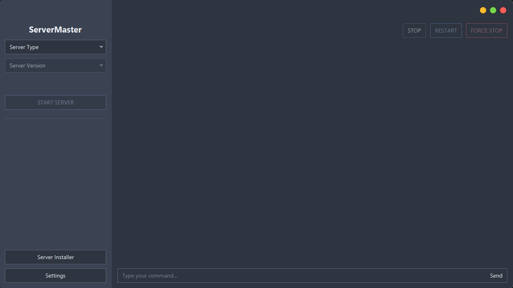
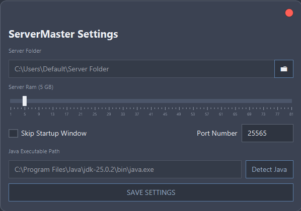
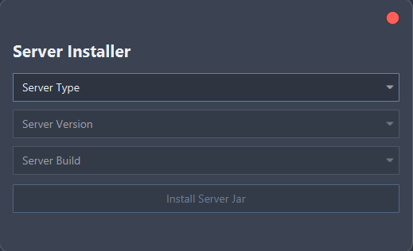
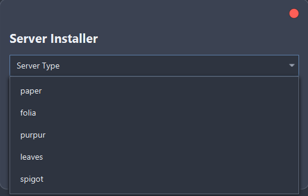

<a name="readme-top"></a>
<br />
<div align="center">

[![Contributors][contributors-shield]][contributors-url]
[![Forks][forks-shield]][forks-url]
[![Stargazers][stars-shield]][stars-url]
[![Issues][issues-shield]][issues-url]
[![GNU License][license-shield]][license-url]

<a href="https://github.com/brainsynder-Dev/ServerMaster">
  
</a>

<h3 align="center">Server Master</h3>

<p align="center">
  A powerful desktop application to manage, switch, and run multiple Minecraft server types and versions from a single server folder.
  <br />
  <a href="https://github.com/brainsynder-Dev/ServerMaster/tree/master/src/main/java/org/bsdevelopment/servermaster"><strong>Explore the Code »</strong></a>
  <br /><br />
  <a href="https://github.com/brainsynder-Dev/ServerMaster/issues">Report Bug</a>
  ·
  <a href="https://github.com/brainsynder-Dev/ServerMaster/issues">Request Feature</a>
  ·
  <a href="https://github.com/brainsynder-Dev/ServerMaster/pulls">Pull Request</a>
</p>
</div>

---

## 🚀 About The Project

ServerMaster originally started as a simple batch file for switching between server types (Spigot, Paper, etc.) and versions. It has since evolved into a full-featured JavaFX desktop application built for developers and server administrators.

---

## ✨ What's New in v1.6
- Improved installer dialog
- New application icon
- Spigot buildtools installer
- gamerules applied on server start via new gamerules.json file

#### Example gamerules.json file:
**NOTE:** `The file must be created in the same folder as the application, it is not generated by default.`
```json
{
    "rules": [
        { "name": "keep_inventory", "value": "true", "aliases": ["keepInventory"] },
        { "name": "immediate_respawn", "value": "true", "aliases": ["doImmediateRespawn"] },
        { "name": "advance_time", "value": "false", "aliases": ["doDaylightCycle"] },
        { "name": "advance_weather", "value": "false", "aliases": ["doWeatherCycle"] },
        { "name": "spawn_wandering_traders", "value": "false", "aliases": ["doTraderSpawning"] },
        { "name": "spawn_mobs", "value": "false", "aliases": ["doMobSpawning"] },
        { "name": "spawn_patrols", "value": "false", "aliases": ["doPatrolSpawning"] },
        { "name": "spawn_phantoms", "value": "false", "aliases": ["doInsomnia"] }
    ]
}
```

---

## 🧱 Built With

- Java 21
- JavaFX
- AtlantaFX (for UI components)

---

## 🛠 Getting Started

### Prerequisites
- Java 21+
- Server folder `Location where the server will run`
- Application folder `Location where the application and its config & log are located`

### Installation
1. Download latest release
2. Place executable in its own folder
3. Launch and configure server path
4. Install server jars
5. Select type, version, build
6. Click Start Server

---

## ▶ Usage

### Starting a Server
1. Select Type
2. Select Version
3. Select Build (if applicable)
4. Click 'Start Server'

### Stopping a Server
- `stop` command
- STOP SERVER button
- FORCE STOP button
- Closing app

---
## Screenshots

<div align="center">
    
    
    
    
</div>

---

## 🗺 Roadmap
- [x] Spigot BuildTools installer
- [x] Default gamerules
- [ ] server.properties editor
- [ ] ViaVersion/ViaBackwards Automatic Updates
- [ ] Plugin manager

---

## 📜 License
GPL-3.0 License

---

## 📬 Contact 
https://discord.bsdevelopment.org/

Project:  
https://github.com/brainsynder-Dev/ServerMaster

---

[contributors-shield]: https://img.shields.io/github/contributors/brainsynder-Dev/ServerMaster.svg?style=for-the-badge
[contributors-url]: https://github.com/brainsynder-Dev/ServerMaster/graphs/contributors
[forks-shield]: https://img.shields.io/github/forks/brainsynder-Dev/ServerMaster.svg?style=for-the-badge
[forks-url]: https://github.com/brainsynder-Dev/ServerMaster/network/members
[stars-shield]: https://img.shields.io/github/stars/brainsynder-Dev/ServerMaster.svg?style=for-the-badge
[stars-url]: https://github.com/brainsynder-Dev/ServerMaster/stargazers
[issues-shield]: https://img.shields.io/github/issues/brainsynder-Dev/ServerMaster.svg?style=for-the-badge
[issues-url]: https://github.com/brainsynder-Dev/ServerMaster/issues
[license-shield]: https://img.shields.io/github/license/brainsynder-Dev/ServerMaster.svg?style=for-the-badge
[license-url]: https://github.com/brainsynder-Dev/ServerMaster/blob/master/LICENSE
[product-screenshot]: ./src/main/resources/images/screenshots/main-window.png